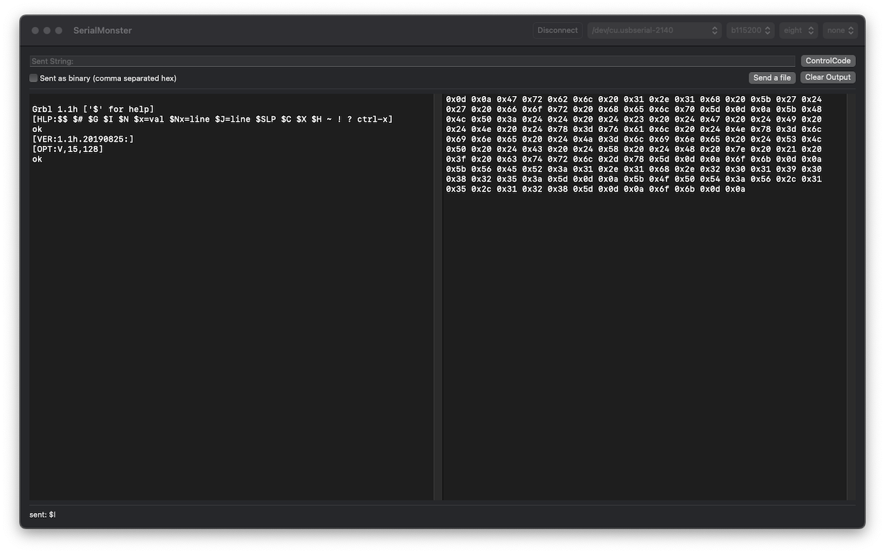
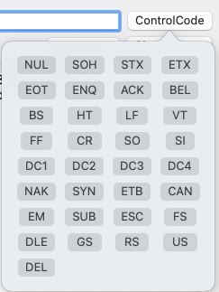
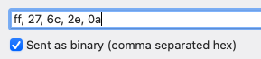
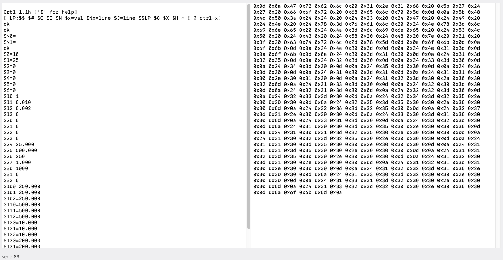

{.center width=100%}

SerialMonster is a simple tool for interacting with serial port device. It can monitor the port, sending text or binary to serial port device.

{width=100%}

## Features 

* Connection configuration.
 
	

* Sending text

	

* Sending Control code

	

* Sending binary (using comma separated hex string)

	

* Sending file as a binary blob

	

* Showing output from serial port as text and binary blob. 

	{width=100%}

## Privacy Policy

This privacy policy describes how your personal information is handled in SerialMonster.

### Owner and Data Controller

SerialMonster is owned and developer by Pongsak Suvanpong. If you have any question, please send me an email psksvp@gmail.com

### Data Collection

SerialMonster.app does not collect, use, save, nor have access to any of your personal data recorded in SerialMonster. Individual settings relating to the SerialMonster.app are not personal and are stored only on your device.

### Changes to This Privacy Policy

This privacy policy can be updated at any time to be conformed to changes of regal or/and social requirements about the personal data collection. It is strongly recommended to check this page often.

This page is last modified on **August 16, 2022**

